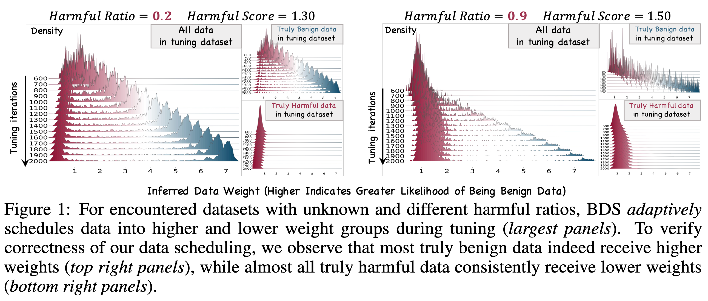
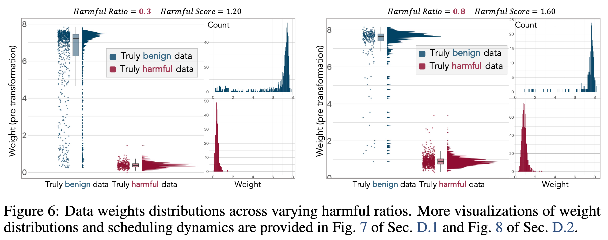

# [NeurIPS 2025] Adaptive Defense against Harmful Fine-Tuning for Large Language Models via Bayesian Data Scheduler


BDS (Bayesian Data Scheduler) is an adaptive defense framework against harmful fine-tuning for Large Language Models (LLMs). It implements a novel approach to data scheduler that enhances safety during the fine-tuning process.

The pipeline of BDS is shown below. A brief workflow is illustrated here.


Representative experimental results:

- **Figure 1**: Data scheduling dynamics under low and high harmful ratios.
- **Figure 6**: Weight distributions under low and high harmful ratios.




## 🚀 Installation

### Environment Setup

1. **Install**
   ```bash
   conda env create -f /content/environment.yml
   conda activate bds
   pip install -e ./OpenRLHFBase/
   pip install -e .
   ```

2. **Datasets**

   Datasets json files are provided in `./run/scripts/datasets`.

   Or you can construct the datasets according the scripts in `run/sst2`, `run/gsm8k`, `run/agnews`, `run/alpaca`.

## ⚙️ Configuration


### Edit Configuration

Edit `./run/scripts/config.sh` with your actual values:

```bash
# API Keys and Tokens
export HUGGINGFACE_TOKEN="your_huggingface_token_here"
export WANDB_API_KEY="your_wandb_api_key_here"
export WANDB_PROJECT="your_project_name"

# Paths
export PREFIX_DIR="/path/to/your/bds/project"
```


## 🏃 Quick Start

### Training and Evaluation Template

Run the main script (including training, visualization, and evaluation):

```bash
bash ./run/scripts/0_train_eval_dbs.sh
```


## 📁 Project Structure

```
bds/
├── analysis/                    # Analysis and visualization tools
│   ├── mountain_range_plotter.py    # Mountain Range visualization
│   ├── score_analyzer.py           # Score analysis
│   └── llama2guard_analyzer.py     # LlamaGuard analysis
├── bds/                        # Core BDS package
│   ├── datasets/               # Dataset classes
│   ├── models/                 # Model definitions
│   ├── trainer/                # Training logic
│   └── utils/                  # Utilities
├── run/                        # Run scripts and datasets
│   ├── scripts/                # Training scripts
│   │   ├── config.sh           # Configuration template
│   │   ├── 0_train_eval_dbs.sh      # Main training+eval script
│   │   └── datasets/           # Dataset files
│   ├── sst2/                   # SST-2 dataset scripts
│   ├── alpaca/                 # Alpaca dataset scripts
│   ├── gsm8k/                  # GSM8K dataset scripts
│   ├── agnews/                 # AG News dataset scripts
│   └── poison/                 # Poison evaluation scripts
├── environment.yml            # Python dependencies
└── setup.py                   # Package setup
```


## 🔧 Analysis Tools

### 1. Score Analyzer (`analysis/score_analyzer.py`)

Analyzes and processes scoring data from training checkpoints.

**Usage:**
```bash
python analysis/score_analyzer.py --path /path/to/checkpoint --transformation softmax
```

**Parameters:**
- `--path`: Path to the checkpoint directory
- `--transformation`: Transformation type (softmax, linear, etc.)

### 2. Mountain Range Plotter (`analysis/mountain_range_plotter.py`)

Creates Mountain Range style visualizations of training progress.

**Usage:**
```bash
python analysis/mountain_range_plotter.py --path /path/to/checkpoint --step 100 --flag all
```

**Parameters:**
- `--path`: Path to the checkpoint directory
- `--step`: Step size for visualization
- `--flag`: Data filter (all, ft, harmful)
- `--transformation`: Transformation type

### 3. LlamaGuard Analyzer (`analysis/llama2guard_analyzer.py`) (Optional)

Analyzes model outputs using LlamaGuard for safety evaluation.

**Usage:**
```bash
python analysis/llama2guard_analyzer.py
```